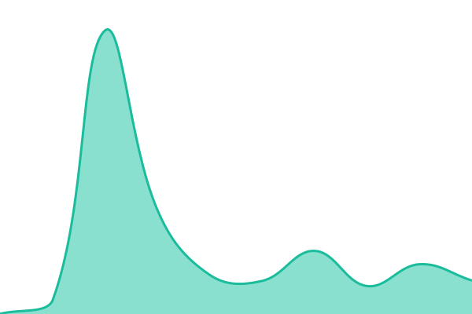
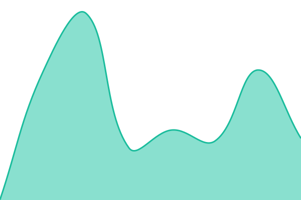

# AppRabbit Status

Live availability for the AppRabbit platform, checked every 5 minutes from
GitHub's infrastructure — deliberately independent of anything we run, so this
page keeps working during an outage of our own.

Setup, probe conventions, and known limits: [SETUP.md](./SETUP.md).

<!--start: status pages-->
<!-- This summary is generated by Upptime (https://github.com/upptime/upptime) -->
<!-- Do not edit this manually, your changes will be overwritten -->
<!-- prettier-ignore -->
| URL | Status | History | Response Time | Uptime |
| --- | ------ | ------- | ------------- | ------ |
|  [API gateway](https://gateway.svcrabbit.com/healthz) | 🟩 Up | [api-gateway.yml](https://github.com/gameplan-apps/statuspage/commits/HEAD/history/api-gateway.yml) | 

 131ms
     
 | 

<a href="https://gameplan-apps.github.io/statuspage/history/api-gateway">100.00%</a>
    

|  [Monolith API](https://monolith.svcrabbit.com/readyz) | 🟩 Up | [monolith-api.yml](https://github.com/gameplan-apps/statuspage/commits/HEAD/history/monolith-api.yml) | 

 229ms
     
 | 

<a href="https://gameplan-apps.github.io/statuspage/history/monolith-api">100.00%</a>
    

|  [Studio dashboard](https://studio.apprabbit.app/) | 🟩 Up | [studio-dashboard.yml](https://github.com/gameplan-apps/statuspage/commits/HEAD/history/studio-dashboard.yml) | 

 210ms
     
 | 

<a href="https://gameplan-apps.github.io/statuspage/history/studio-dashboard">100.00%</a>
    

|  [Marketing site](https://apprabbit.com) | 🟩 Up | [marketing-site.yml](https://github.com/gameplan-apps/statuspage/commits/HEAD/history/marketing-site.yml) | 

 283ms
     
 | 

<a href="https://gameplan-apps.github.io/statuspage/history/marketing-site">100.00%</a>
    

<!--end: status pages-->

<!--start: live status-->
<!--end: live status-->
